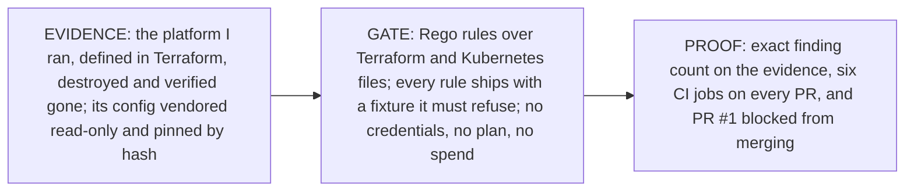

# network-as-code

A CI gate for infrastructure-as-code. It reads Terraform and Kubernetes files,
applies security, observability and cost rules written in OPA Rego, and fails
the build — and blocks the merge — when a rule is violated. No cloud
credentials, no `terraform plan`, no spend: files in, verdict out.



## The proof

The default branch, `main`, requires all six gate jobs to pass, with no
bypass for anyone — the owner included. That is read from GitHub's API, not a
screenshot: six required contexts, `enforce_admins: true`.

[PR #1](https://github.com/hossainpazooki/network-as-code/pull/1) adds one
file — a security group open to `0.0.0.0/0` — to the set of fixtures the
`conforming` job asserts must pass. **The violating file turned exactly the
job that reads it red.** Run `33090175858`: `conforming` failed with the
SEC-001 message naming the file; GitHub's API reported
`mergeStateStatus: BLOCKED`. The claim is no broader than that: the two jobs
that passed run before `conforming` and never read that directory, and the
three after it were skipped. If the PR is closed when you read this, the run
log is the record; `STATUS.md` quotes it.

## See it refuse yourself

```
$ cd gates && ./run.sh demo

FAIL - fixtures/violations/perfile/netpol-wide-ipblock.yaml - main - SEC-002:
egress ipBlock 10.0.0.0/8 is broader than the declared VPC CIDR 10.0.0.0/16
(NetworkPolicy egress-wide-demo, egress[0].to[0])

16 tests, 15 passed, 0 warnings, 1 failure, 0 exceptions
conftest exit code: 1 (non-zero = refused)
```

`./run.sh gate` is the full build: provenance, unit tests, conforming
fixtures, refusals, coverage, self-audit — the same six steps CI runs as jobs.

## Three properties

**Fail closed, including against the tools.** No `|| true` or
`continue-on-error` anywhere. A tool *error* is never counted as a refusal:
`conftest` exits 1 both when a policy refuses and when it cannot parse the
input, so the harness ignores the exit code and counts the deny messages.
Infracost exits 0 after a failed parse and reports $0.00 — under every
ceiling — so FIN-003 refuses a breakdown with errors or zero resources; its v2
release renamed the keys FIN-002 reads, so FIN-004 refuses a breakdown the
policy cannot read. *evidence → `STATUS.md`, "What running Infracost changed"*

**Every control has a negative control.** Each of the 10 rule IDs has a
fixture the gate must refuse — 19 in all, asserted on every run — and for each
of the 16 deny clauses the build deletes that clause, re-runs the fixtures,
and requires some fixture to lose a finding. A clause whose deletion changes
nothing has no evidence behind it, and the build goes red. Rules that find
nothing in my config are proven live this way, not assumed dead.
*evidence → `STATUS.md`, "Known limit — CLOSED"*

**Evidence over assertion, and Terraform evaluated as Terraform.** The
platform's configuration is vendored read-only: a complete Terraform root
module of 31 files, pinned file-by-file by git blob SHA, never edited. The
self-audit asserts an **exact** finding count — 15 — so a rule that silently
stops firing fails the build as loudly as a new finding. The rules see the
root module as one unit, because provider-level `default_tags` apply to the
whole module and a per-file rule reported findings that were false.
*evidence → `STATUS.md`, "The 15 historical findings"*

## Where it came from

I defined an AWS platform end to end in Terraform — EKS, VPC, NAT, RDS,
ElastiCache, Secrets Manager, IAM — ran it, and destroyed it through
Terraform, checking each resource gone against the AWS API on 2026-08-03
(`terraform state list` → 0). The retrospective found one gap: the scanner
could never fail a build. Its steps ended in `|| true`, the shell idiom for
"ignore the exit code", so every finding produced a report and a green tick.
This repo is the control that was missing.

## The correction log is the point, not an embarrassment

`STATUS.md` records what adversarial review and real tool runs changed,
postmortem-style. Three worth a leader's minute:

- **CI was red for a day and the docs couldn't have told you.** A Windows
  filemode quirk shipped `run.sh` non-executable; the first job died in 13
  seconds and the policy jobs were skipped. It recurred one level up: a gate
  step ran for three days with no CI job at all, while four documents said
  otherwise.
- **The provenance check verified the ledger, not the tree.** A stray tool
  cache wrote 822 files *into* the evidence directory and "22 files verified"
  still printed. The check now asserts the tree holds exactly the recorded
  set, with a mutation test proving it fails on one added file.
- **The cost ceilings were guesses.** `budget.json` said dev = 250 while the
  first real Infracost run measured the shipped topology at 594. The ceilings
  are now derived from measurements — dated by the measurement's own
  timestamp, not the session brief.

These controls were built with AI assistance, held to the regime the artifact
itself enforces: every claim refuted before it was written down, every guard
mutation-proven red and green, every misfire ledgered. `STATUS.md` is the
evidence, not this sentence.

## Not claimed

Nothing running is enforced — this gates files, not clusters, and no
Terraform is authored or applied here. Live plan/apply gating is not built.
The committed cost figures are point-in-time estimates from one dated run,
not a statement about what anything costs now; why Infracost is not called in
CI, and where it would be, is in `docs/design.md`.

## Go deeper

| Read | For |
|---|---|
| [`STATUS.md`](STATUS.md) | the claim ceiling: every number from a dated run, the correction log in full, what is not yet true |
| [`docs/design.md`](docs/design.md) | how the mechanisms work, with diagrams: exit-code ambiguity, clause coverage, the provenance chain, generation vs evaluation; the Terraform root-module story; the Infracost design note |
| [`docs/learnings/`](docs/learnings/LEARNINGS.md) | 15 dated findings, each with a one-line read-only re-verify command |
| [`docs/handoff/`](docs/handoff/HANDOFF.md) | session briefs written for a skeptical pick-up |
| [`gates/`](gates/) | the rules, tests, fixtures and `run.sh`; layout in `docs/design.md` |
