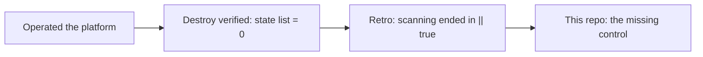
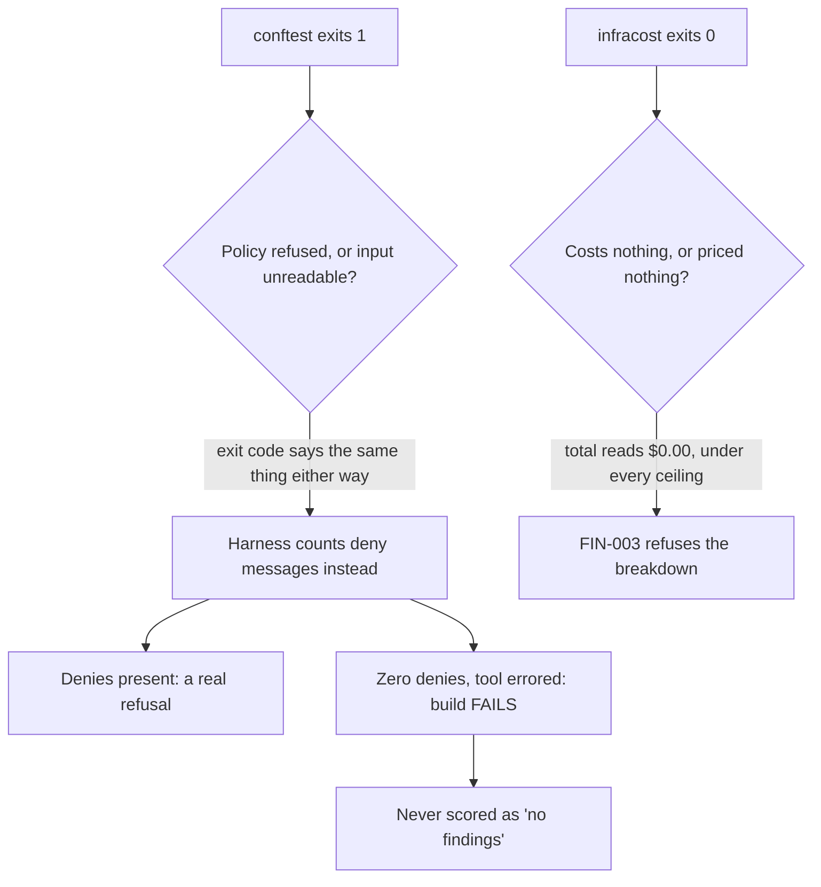
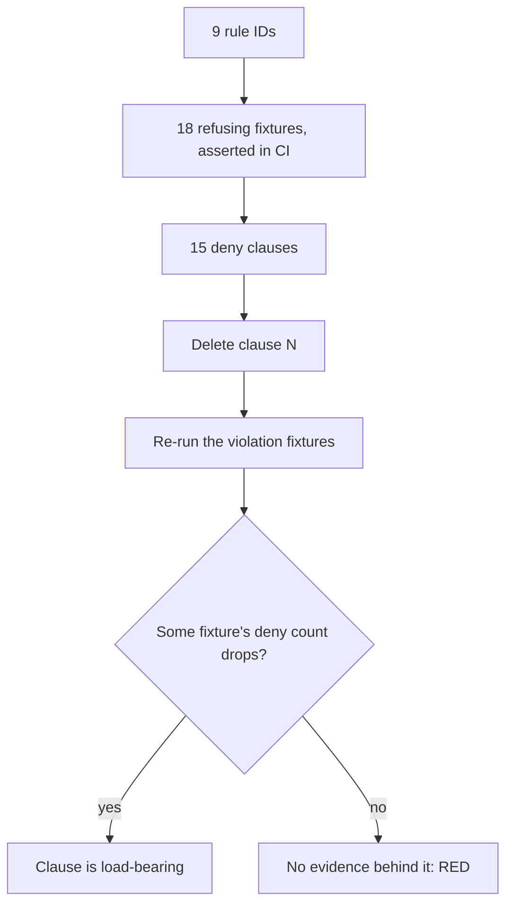
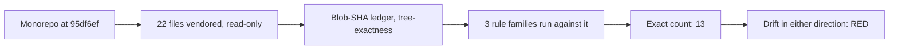
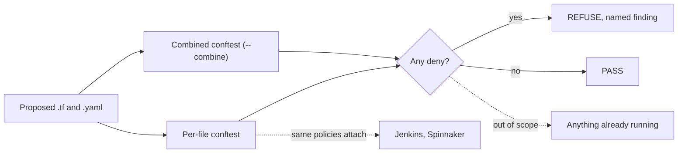

# network-as-code

I designed and operated an AWS platform — EKS, VPC, NAT, ElastiCache, RDS,
Secrets Manager — and then decommissioned it, verifying the teardown by probing
the AWS API afterwards rather than trusting the apply log: `terraform state
list` returned 0 resources, and every cluster, subnet, gateway, secret, log
group and IAM role was individually checked gone on 2026-08-03.

The retrospective finding was an enforcement gap. The platform had scanning;
it did not have refusal. Its Checkov steps ended in `|| true`, so every
finding produced an artifact and a green check — a detective control dressed
as a preventive one. This repo is the control that was missing, built to the
standard I would want to inherit in production: **a gate that cannot fail is
not a gate, so every rule here ships with proof that it refuses.**



## See it refuse (30 seconds)

```
$ cd gates && ./run.sh demo

FAIL - fixtures/violations/perfile/netpol-wide-ipblock.yaml - main - SEC-002:
egress ipBlock 10.0.0.0/8 is broader than the declared VPC CIDR 10.0.0.0/16
(NetworkPolicy egress-wide-demo, egress[0].to[0])

15 tests, 14 passed, 0 warnings, 1 failure, 0 exceptions
conftest exit code: 1 (non-zero = refused)
```

The full build is `./run.sh gate`: provenance, unit tests, conforming
fixtures, refusals, coverage, self-audit. Each of those six steps runs as its
own job in GitHub Actions on every push and pull request, with the
conftest/OPA binaries sha256-verified against the publishers' checksums before
execution. Zero credentials, zero cloud spend, in CI or anywhere else: nothing
here calls AWS.

## Three properties, and how each one is proven

**1 — Fail closed, including against the tools themselves.** No `|| true` or
`continue-on-error` anywhere in the workflow — the rule exists because I
shipped the opposite once. Less obviously: a tool error is never counted as a
refusal. `conftest` exits 1 both when a policy refuses and when it cannot
parse the input, so the harness counts actual deny messages. The same defect
class appeared twice more and each time became a rule: Infracost exits 0 on a
failed parse and reports a total of $0.00 — under every budget ceiling — so
FIN-003 refuses any cost breakdown carrying evaluation errors or zero detected
resources. Tools report "I could not evaluate this" through the same channel
as "this is fine"; the gate treats the two differently.



**2 — Every control has a negative control.** You test a pager by firing it.
Each of the 9 rule IDs has at least one fixture the gate must refuse — 18 in
all, asserted refused on every run — and coverage goes one level deeper: for
each of the 15 deny clauses, the check deletes that clause and asserts some
refusing fixture's deny count drops. A clause whose deletion changes nothing
has no evidence behind it, and the build goes red. Rules that find nothing in
my config (SEC-001: no `0.0.0.0/0` anywhere) are proven live this way, not
assumed dead.



**3 — Evidence over assertion.** The decommissioned platform's configuration
is vendored read-only under `gates/fixtures/historical/`, pinned file-by-file
by git blob SHA and never edited — the violations in it are the measurement.
`./run.sh historical` runs all three rule families against it and asserts an
**exact** finding count (13), so a rule that silently stops firing fails the
build as loudly as a new finding does:



| Rule | Findings | What it says about the platform I ran |
|---|---|---|
| FIN-001 allocation tags | 8 | `App` missing on 8 resources — cost-per-app was unanswerable |
| OBS-001 flow logs | 1 | the VPC shipped without flow logs |
| SEC-002 egress vs VPC CIDR | 3 | egress policies broader than the network they lived in |
| SEC-003 no default-deny ingress | 1 | egress-only NetworkPolicies, ingress open by omission |

Claims about this repo follow the same discipline: `STATUS.md` is the claim
ceiling — every number in it comes from a dated run, and anything not yet true
sits in its "Not yet" section by name.

## The correction log is the point, not an embarrassment

`STATUS.md` records what adversarial review and first real tool runs changed,
postmortem-style. Three worth a leader's minute:

- **FIN-001 reported findings that were false.** Terraform's provider-level
  `default_tags` applies to the whole root module; a per-file rule couldn't
  see it and flagged `Environment` as missing when it wasn't. Fixed by moving
  the rule to cross-file evaluation — because a gate that emits untrue
  findings teaches its users to ignore it, and gate adoption is a trust
  problem before it is a policy problem. The finding count didn't move; the
  messages became true.
- **CI was red for a day and the docs couldn't have told you.** A Windows
  filemode quirk shipped `run.sh` non-executable; the first job died in 13
  seconds and the policy jobs were skipped. The fix is one line; the lesson —
  "the gate works" rested on local runs until a runner proved it — is in the
  log.
- **The provenance check verified the ledger, not the tree.** A stray tool
  cache wrote 822 files *into* the evidence directory and "22 files verified"
  still printed. Caught because the finding count moved. The check now asserts
  the tree contains exactly the recorded set, with a mutation test proving it
  fails on one added file.

## What this is, and is not

A CI policy gate over declarative files — Terraform and Kubernetes manifests —
with three rule families: security, observability, FinOps. OPA/Rego under
conftest, which is the portable part: the same policies attach to Jenkins or
Spinnaker pipelines the same way they attach to GitHub Actions here.



Not claimed, deliberately: nothing running is enforced (this gates files, not
clusters); the committed Infracost figures are synthetic and marked as such —
real breakdowns were run locally on 2026-08-26 and deliberately not committed
pending re-derived ceilings (`STATUS.md` records the measured numbers and the
adoption plan); and the gate has refused in CI but has not yet blocked a pull
request from merging — the demonstration PR is the next artifact.
<!-- UPGRADE 1, after refusal-PR evidence exists: replace the last clause with
     "and here is the gate blocking a merge: PR #N — the conforming corpus
     check goes red on a deliberate violation while merging is blocked." -->
CI is green across all six jobs: run
[`33081248574`](https://github.com/hossainpazooki/network-as-code/actions/runs/33081248574)
evaluated every rule on Linux, refused all 18 negative controls, proved all 15
deny clauses load-bearing, and reproduced the 13 historical findings exactly.
`STATUS.md` quotes the log lines rather than the check mark.

## Layout

```
gates/policy/              per-file rules        gates/tests/       unit tests, per family
gates/policy/combined/     cross-file rules      gates/fixtures/    historical (pinned) /
gates/policy/budget.json   FIN ceilings                             conforming / violations
gates/run.sh               every target CI runs  STATUS.md          the claim ceiling
```
