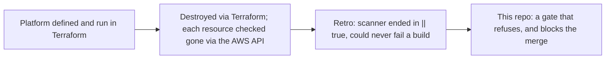
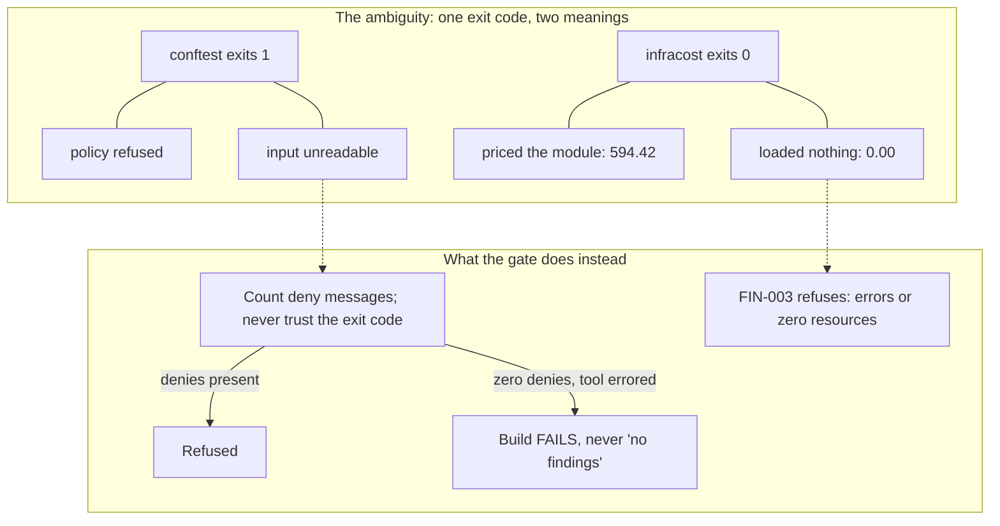
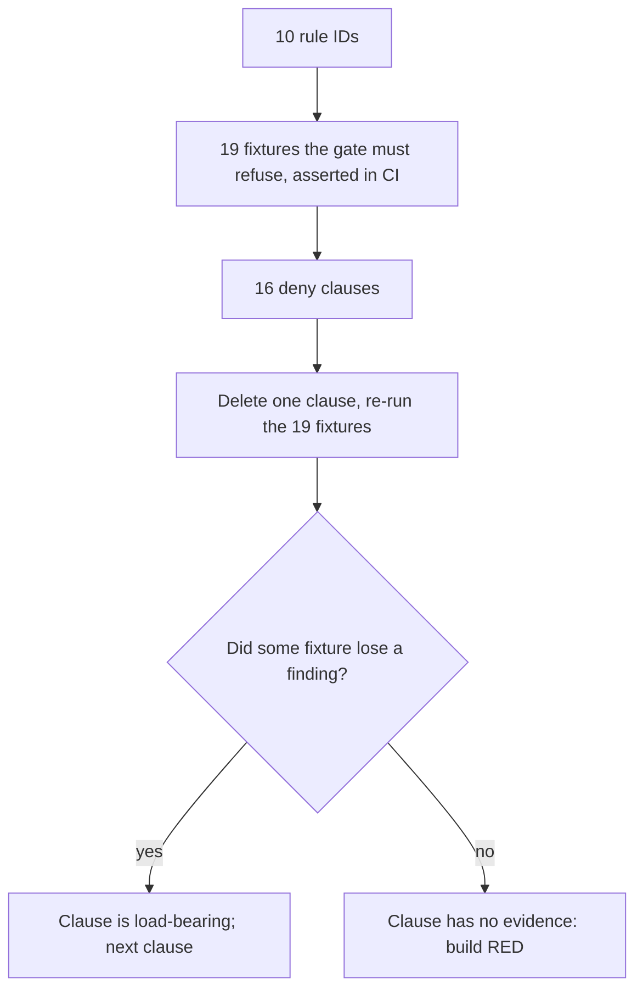
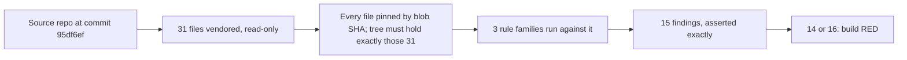
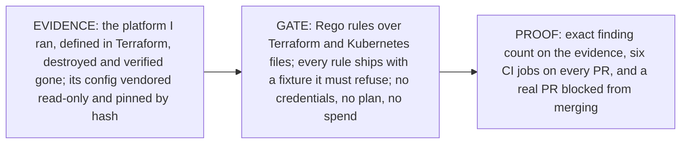
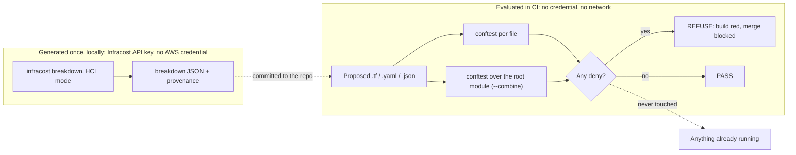

# network-as-code

**What this is.** A CI gate for infrastructure-as-code. It reads Terraform and
Kubernetes files, applies security, observability and cost rules written in
OPA Rego, and fails the build — and blocks the merge — when a rule is violated.
No cloud credentials, no `terraform plan`, no spend: files in, verdict out.

**Where it came from.** I defined an AWS platform end to end in Terraform —
EKS, VPC, NAT, RDS, ElastiCache, Secrets Manager, IAM — ran it, and destroyed
it through Terraform, checking each resource gone against the AWS API on
2026-08-03 rather than trusting the apply log (`terraform state list` → 0).
The retrospective found one gap. The platform had a scanner, but the scanner
could never fail a build: its steps ended in `|| true`, the shell idiom for
"ignore the exit code", so every finding produced a report and a green tick.
Scanning without refusal. This repo is the control that was missing.

**What it proves, and how.** Three things, each with evidence you can re-run:
the gate fails closed, even when a tool errors rather than refuses; every
rule ships with a fixture the gate *must* refuse, and the build goes red if a
rule stops refusing; and the rules are measured against the real, pinned
configuration of the platform I ran — 15 findings, asserted as an exact count.
The standard throughout: **a gate that cannot fail is not a gate.**



## See it refuse (30 seconds)

```
$ cd gates && ./run.sh demo

FAIL - fixtures/violations/perfile/netpol-wide-ipblock.yaml - main - SEC-002:
egress ipBlock 10.0.0.0/8 is broader than the declared VPC CIDR 10.0.0.0/16
(NetworkPolicy egress-wide-demo, egress[0].to[0])

16 tests, 15 passed, 0 warnings, 1 failure, 0 exceptions
conftest exit code: 1 (non-zero = refused)
```

The full build is `./run.sh gate`: provenance check, unit tests, conforming
fixtures, refusals, coverage, self-audit. Each of those six steps is its own
job in GitHub Actions on every push and pull request; the conftest/OPA binaries
are sha256-verified against the publishers' checksums before they run.

## See it block a merge

`master` requires all six jobs to pass, with no bypass for anyone, the owner
included. [PR #1](https://github.com/hossainpazooki/network-as-code/pull/1)
adds one file — a security group open to `0.0.0.0/0` — to the set of fixtures
the `conforming` job asserts must pass. **The violating file turned exactly
the job that reads it red**: `conforming` fails with the SEC-001 message
naming the file, GitHub's API reports `mergeStateStatus: BLOCKED`, and the PR
stays open and unmerged as the standing artifact. The claim is no broader
than that: the two jobs that passed run before `conforming` and never read
that directory, and the three after it were skipped. `STATUS.md` records the
job log and the API state as of that run.

## Three properties, and how each one is proven

**1 — Fail closed, including against the tools themselves.** No `|| true` or
`continue-on-error` anywhere in the workflow — the rule exists because I
shipped the opposite once. Less obviously: a tool *error* is never counted as
a refusal. `conftest` exits 1 both when a policy refuses and when it cannot
parse the input, so the harness ignores the exit code and counts the deny
messages themselves. The same defect appeared twice more, in Infracost, and
each time became a rule: it exits 0 after a failed parse and reports a total
of $0.00 — under every budget ceiling — so FIN-003 refuses any breakdown
carrying evaluation errors or zero detected resources; and its v2 release
renamed the JSON keys FIN-002 reads, against which the rule would bind nothing
and approve everything, so FIN-004 refuses a breakdown with no project in the
shape the policy can read. Tools report "I could not evaluate this" through
the same channel as "this is fine"; the gate treats the two differently.



**2 — Every control has a negative control.** You test a pager by firing it.
Each of the 10 rule IDs has at least one fixture the gate must refuse — 19 in
all, asserted refused on every run — and coverage goes one level deeper: for
each of the 16 deny clauses, the check deletes that clause, re-runs the
fixtures, and asserts some fixture's deny count drops. A clause whose deletion
changes nothing has no evidence behind it, and the build goes red. Rules that
find nothing in my config (SEC-001: no `0.0.0.0/0` anywhere) are proven live
this way, not assumed dead.



**3 — Evidence over assertion, and Terraform evaluated as Terraform.** The
decommissioned platform's configuration is vendored read-only under
`gates/fixtures/historical/`: a complete Terraform root module — 31 files,
including the local `modules/iam/*` it sources — plus its Kubernetes manifests,
pinned file-by-file by git blob SHA and never edited. The violations in it are
the measurement. `./run.sh historical` runs all three rule families against it
and asserts an **exact** finding count (15), so a rule that silently stops
firing fails the build as loudly as a new finding does.



| Rule | Findings | What it says about the platform I ran |
|---|---|---|
| FIN-001 allocation tags | 10 | `App` missing on 10 resources, IAM roles included — cost-per-app was unanswerable |
| OBS-001 flow logs | 1 | the VPC shipped without flow logs |
| SEC-002 egress vs VPC CIDR | 3 | egress policies broader than the network they lived in |
| SEC-003 no default-deny ingress | 1 | egress-only NetworkPolicies, ingress open by omission |

The FIN-001 line is the repo's best Terraform story. The rule was wrong until
it learned how Terraform actually behaves: it ran per file, and reported
`Environment` missing on eight resources whose provider block — with
`default_tags` — sat in `versions.tf`. In Terraform, `default_tags` is a
property of the provider configuration and applies to the whole root module,
child modules included when they declare no provider of their own; which file
a resource is written in means nothing. So the gate now evaluates the root
module as one unit (`--combine`), credits the union of every `default_tags`
block it finds, and the findings became true — the count did not move, the
messages did. That is the line separating this gate from a per-file linter,
and it is also why the nine `modules/iam/*` files had to be vendored: an
incomplete root module is an incomplete measurement.

Claims about this repo follow the same discipline: `STATUS.md` is the claim
ceiling — every number in it comes from a dated run, and anything not yet true
sits in its "Not yet" section by name.

## The correction log is the point, not an embarrassment

`STATUS.md` records what adversarial review and real tool runs changed,
postmortem-style. Three worth a leader's minute:

- **CI was red for a day and the docs couldn't have told you.** A Windows
  filemode quirk shipped `run.sh` non-executable; the first job died in 13
  seconds and the policy jobs were skipped. The fix is one line; the lesson —
  "the gate works" rested on local runs until a runner proved it — is in the
  log. It recurred one level up: a gate step ran for three days with no CI
  job at all, while four documents said otherwise.
- **The provenance check verified the ledger, not the tree.** A stray tool
  cache wrote 822 files *into* the evidence directory and "22 files verified"
  still printed. Caught because the finding count moved. The check now asserts
  the tree contains exactly the recorded set, with a mutation test proving it
  fails on one added file.
- **The cost ceilings were guesses.** `budget.json` said dev = 250 while the
  first real Infracost run measured the shipped topology at 594. The ceilings
  are now derived from measurements — and the measurement's own timestamp,
  not the session brief, is what the record dates it by.

These controls were built with AI assistance, held to the regime the artifact
itself enforces: every claim refuted before it was written down, every guard
mutation-proven red and green, every misfire ledgered. `STATUS.md` is the
evidence, not this sentence.

## The whole thing in three boxes



## What this is, and is not

A CI policy gate over Terraform and Kubernetes manifests, three rule families:
security, observability, FinOps. It parses HCL directly and evaluates
root-module semantics with **no `terraform init`, `plan` or `apply`** — and
therefore no credentials, which is why it runs anywhere, CI included, at zero
spend. Cost gating reads Infracost's HCL-mode breakdown of the same root
module, priced without a plan file: generated once, locally, with an Infracost
API key and no AWS credential, committed with its provenance, and evaluated in
CI as bytes. The claim that supports is *cost-delta gating demonstrated on
pinned point-in-time estimates* — the shipped topology passes its ceiling, the
per-AZ-NAT variant is refused — not "cost controlled", not "live". OPA/Rego
under conftest is the portable part: the same policies attach to Jenkins or
Spinnaker pipelines the same way they attach to GitHub Actions here.



Why Infracost is not called in CI, and where it would be. Pricing needs an
Infracost API key, and this repo's one non-negotiable is no credential at
evaluation time. Beyond that, a verdict that depends on a live pricing service
is not deterministic: the same commit could pass one day and fail the next
with no change to the code, and the tool's own failure modes (exit 0 on a
failed parse; a renamed schema on upgrade) would be live in the pipeline
instead of caught once, by a person reading the output. Committing the
breakdown puts the number that gets gated in the diff. In a real pipeline the
*generation* step is what moves: an Infracost run per pull request, a scoped
key in a secret, producing the breakdown that the same FIN-002/003/004 rules
then evaluate. The rules do not change; only where the JSON comes from does.

Not claimed, deliberately: nothing running is enforced (this gates files, not
clusters, and no Terraform is authored or applied here); live plan/apply gating
is not built; and the committed cost figures are point-in-time estimates from
one dated run, not a statement about what anything costs now.

CI is green across all six jobs on this tree: run
[`33089563447`](https://github.com/hossainpazooki/network-as-code/actions/runs/33089563447)
verified 31 files against the ledger, refused all 19 negative controls, proved
all 16 deny clauses load-bearing, and reproduced the 15 historical findings
exactly. `STATUS.md` quotes the log lines rather than the check mark.

## Layout

```
gates/policy/              per-file rules        gates/tests/       unit tests, per family
gates/policy/combined/     root-module rules     gates/fixtures/    historical (31, pinned) /
gates/policy/budget.json   FIN ceilings, derived                    conforming / violations
gates/run.sh               every gate step CI runs   STATUS.md      the claim ceiling
```
