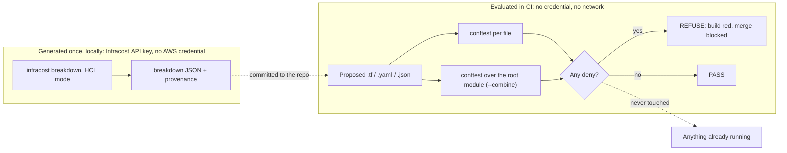
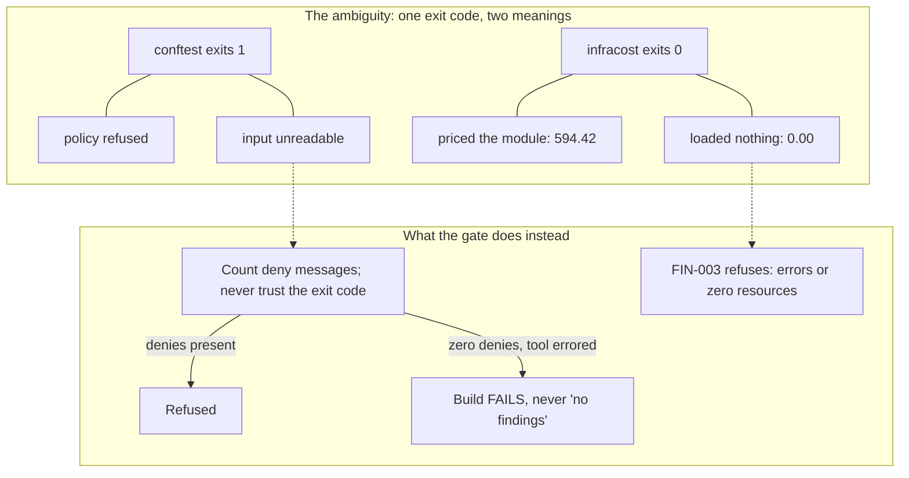
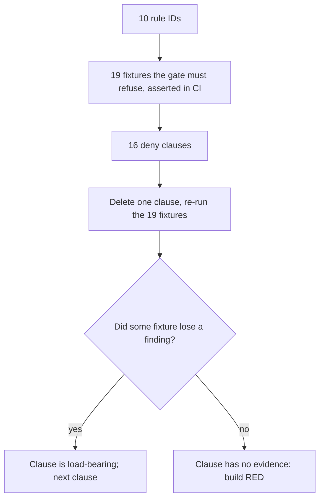
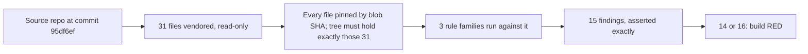

# Design — how the gate works

The README states what is true; `STATUS.md` proves it with dated runs. This
page explains the mechanisms. Nothing here carries a number that `STATUS.md`
does not.

## The whole thing, and where the boundary is



Files in, verdict out. Two conftest invocations, because the input shape
differs: per-file evaluation sees one parsed document; `--combine` sees the
whole root module as a list of documents, which is the only mode in which a
provider-wide fact can be evaluated (below). OPA/Rego under conftest is the
portable part: the same policies attach to Jenkins or Spinnaker pipelines the
same way they attach to GitHub Actions here.

## Fail closed against the tools themselves

`conftest` exits 1 both when a policy refuses and when it cannot parse the
input. An exit-code check would count an empty directory as a passing
negative control, which makes the whole methodology vacuous — so `run.sh`
never reads `$?` as a verdict. It asks conftest for JSON, counts the deny
messages, and treats an unparseable input as an error that fails the build.

Infracost has the same shape twice over. It exits 0 after a failed module
load and reports `totalMonthlyCost` "0" — under every budget ceiling — so
FIN-003 refuses a breakdown carrying evaluation errors or zero detected
resources. Its v2 release renamed the JSON keys FIN-002 reads
(`projects[].name` → `project_name`, `breakdown.totalMonthlyCost` →
`summary.total_monthly_cost`); against a v2 file FIN-002 binds nothing and
approves everything, so FIN-004 refuses a breakdown with no project in the
shape the policy can read.



Tools report "I could not evaluate this" through the same channel as "this
is fine"; the gate treats the two differently. `grep -c` belongs to the same
family — it exits 1 on a count of zero, which under `set -e` stops a script
silently mid-loop — and the ledger records the day it did exactly that.

## Every control has a negative control

You test a pager by firing it. Each rule ID has at least one fixture under
`gates/fixtures/violations/` that the gate must refuse; `./run.sh violations`
asserts every one of them, per class, and fails the build if any is accepted.

That is ID-level coverage, and it has a blind spot: a rule with several deny
clauses counts as covered when *any* clause fires, so a dead clause hides
behind live siblings. It happened once, by hand. The clause pass closes it by
asserting the property directly — deleting any one clause must reduce some
fixture's deny count — with no change to any message, fixture or test.



Only `fixtures/violations/` counts as a control. A clause that fires solely on
the historical evidence reads as uncovered by design: a historical finding is
evidence of what was shipped, not a control over what may ship.

## Evidence over assertion: the provenance chain

The decommissioned platform's configuration is vendored under
`gates/fixtures/historical/`: a complete Terraform root module — 31 files,
including the local `modules/iam/*` it sources — plus its Kubernetes
manifests. Every file is pinned by git blob SHA in `BLOBSHAS.txt`, and the
check asserts the tree contains exactly that set: a modified file fails, and
so does an added one (the day an 822-file tool cache landed in the tree with
every blob SHA still matching is in the ledger).



| Rule | Findings | What it says about the platform I ran |
|---|---|---|
| FIN-001 allocation tags | 10 | `App` missing on 10 resources, IAM roles included — cost-per-app was unanswerable |
| OBS-001 flow logs | 1 | the VPC shipped without flow logs |
| SEC-002 egress vs VPC CIDR | 3 | egress policies broader than the network they lived in |
| SEC-003 no default-deny ingress | 1 | egress-only NetworkPolicies, ingress open by omission |

## Terraform evaluated as Terraform

The FIN-001 line is the repo's best Terraform story. The rule was wrong until
it learned how Terraform actually behaves: it ran per file, and reported
`Environment` missing on eight resources whose provider block — with
`default_tags` — sat in `versions.tf`. In Terraform, `default_tags` is a
property of the provider configuration and applies to the whole root module,
child modules included when they declare no provider of their own; which file
a resource is written in means nothing. So the gate evaluates the root module
as one unit (`--combine`), credits the union of every `default_tags` block it
finds, and the findings became true — the count did not move, the messages
did. That is the line separating this gate from a per-file linter.

It is also why the nine `modules/iam/*` files had to be vendored: an
incomplete root module is an incomplete measurement, and Infracost, given the
incomplete tree, priced nothing and exited 0. They were added once, from the
same source commit, under a sanctioned exception to the no-additions rule that
`STATUS.md` records and `CLAUDE.md` marks as spent. Evaluating `modules/` on
its own emits a false `Environment` finding — the modules inherit the root
provider — so `run.sh` evaluates `terraform/` and `modules/` as one combined
set, always.

## Why Infracost is not called in CI, and where it would be

Cost gating reads Infracost's HCL-mode breakdown of the same root module,
priced without a plan file: generated once, locally, with an Infracost API key
and no AWS credential, committed with a `_provenance` block (tool version,
exact command, source commit plus ledger hash, timestamp), and evaluated in CI
as bytes. The claim that supports is *cost-delta gating demonstrated on pinned
point-in-time estimates* — the shipped topology passes its ceiling, the
per-AZ-NAT variant is refused — not "cost controlled", not "live".

Pricing needs an Infracost API key, and this repo's one non-negotiable is no
credential at evaluation time. Beyond that, a verdict that depends on a live
pricing service is not deterministic: the same commit could pass one day and
fail the next with no change to the code, and the tool's own failure modes
(exit 0 on a failed parse; a renamed schema on upgrade) would be live in the
pipeline instead of caught once, by a person reading the output. Committing
the breakdown puts the number that gets gated in the diff.

In a real pipeline the *generation* step is what moves: an Infracost run per
pull request, a scoped key in a secret, producing the breakdown that the same
FIN-002/003/004 rules then evaluate. The rules do not change; only where the
JSON comes from does. The Infracost GitHub App, which attached itself to the
repository when Infracost Cloud was authenticated, was removed for the same
reason: its check was not this gate's, and nothing here could vouch for it.

## Layout

```
gates/policy/              per-file rules        gates/tests/       unit tests, per family
gates/policy/combined/     root-module rules     gates/fixtures/    historical (31, pinned) /
gates/policy/budget.json   FIN ceilings, derived                    conforming / violations
gates/run.sh               every gate step CI runs   STATUS.md      the claim ceiling
.github/workflows/gate.yml one job per gate step, six in all, chained
```
